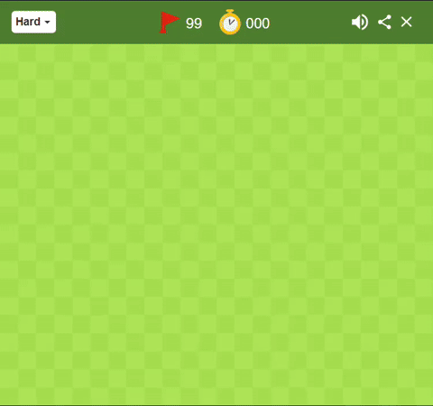

# Minesweeper Solver

A Python bot that plays Google Minesweeper automatically. It reads the board using OpenCV, figures out safe cells and mines using constraint logic, and clicks them using PyAutoGUI.



> **Note:** Currently Windows-only (uses `ctypes` for global hotkeys and `winsound` for audio feedback).

## Features

- **Difficulty selector** — Easy (10x8), Medium (18x14), Expert (24x20)
- **Screen calibration** — hover over two corners and press Spacebar to map the board region on any monitor
- **Emergency stop** — press `ESC` at any time to halt the bot
- **Win/loss tracker** — logs games, wins, losses, and win rate to `stats.json`

## Project Structure

```
Minesweeper/
├── solver/
│   ├── constants.py   # Board dimensions, color ranges, calibration loader
│   ├── vision.py      # Screenshot capture and cell color detection
│   ├── solver.py      # Constraint solving and mouse click execution
│   └── stats.py       # Game result logger
├── calibrate.py       # Interactive Spacebar calibration tool
├── main.py            # Entry point
└── requirements.txt
```

## Getting Started

### Prerequisites

- Python 3.10+
- Windows OS
- A browser with [Google Minesweeper](https://www.google.com/search?q=minesweeper) open

### Install

```bash
git clone https://github.com/Amritesh-Singh-okay/Minesweeper-solver.git
cd Minesweeper-solver

python -m venv venv
venv\Scripts\activate

pip install -r requirements.txt
```

### Run

```bash
python main.py
```

1. Pick a difficulty (1 = Easy, 2 = Medium, 3 = Expert).
2. If no calibration exists, it will ask you to hover over the **top-left** and **bottom-right** corners of the board and press **Spacebar** for each.
3. Switch to your browser. The solver starts automatically.
4. Hold **ESC** anytime to stop.

## License

MIT — see [LICENSE](LICENSE).
